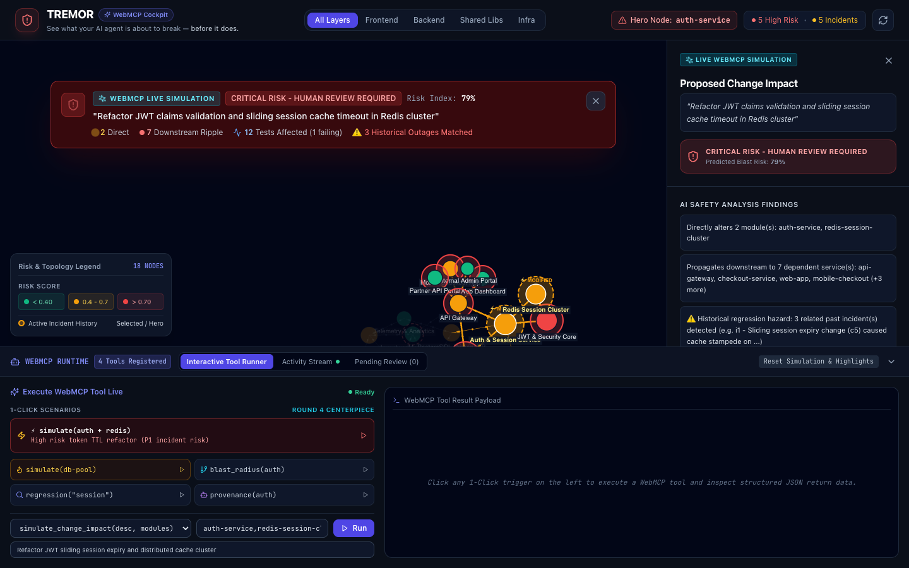

# ⚡ TREMOR
### *Agentic Blast Radius & Systemic Regression Prevention Cockpit*

> **Tagline:** *See what your AI agent is about to break — before it does.*  
> Built for the **WebMCP Challenge 2026** (OpenAI, Google Chrome, Vercel, Cloudflare, Netlify, Shopify, Render).

[](https://tremor-cockpit.vercel.app)
[](https://github.com/mcp-b/global)
[](https://github.com/ABHIGH15/TREMOR)
[](./LICENSE)

> *Note: TREMOR is an independent agentic safety cockpit built for the WebMCP Challenge 2026. It is not affiliated with the `@tremor/react` UI component library or `tremor-runtime`.*

---



---

## 🚨 The Problem: AI Agent Myopia

Autonomous AI coding agents (**Claude Code**, **Cursor**, **Codex**, **ChatGPT**) are exceptionally good at writing localized code, but they suffer from **Architectural Myopia (Tunnel Vision)**:

1. **Localized Context:** When an agent refactors a single backend file (e.g. `auth-service/session.ts`), it only sees that isolated file. It has no intrinsic awareness of the 20 downstream microservices that depend on that token schema.
2. **Hidden Systemic Cascades:** A benign 2-line cache TTL change passes unit tests, but under real-world load it triggers a **Cache Stampede** on Redis, crashing checkout queues across 7 dependent services.
3. **Automated Pipelines are Blind:** Standard CI test runners only test the changed package, silently allowing high-risk architectural regressions to ship to production.

---

## 🛡️ The Solution: TREMOR Cockpit

**TREMOR** is an interactive, browser-resident "System Context Cockpit" that provides autonomous AI agents and human engineers with the *exact same* real-time picture of distributed topology, transitive blast radius, and historical regression precedents before any code ships.

When an AI agent connects to TREMOR via **WebMCP** (`document.modelContext`), the webpage transforms into an interactive API:
- The agent queries topology via multi-root BFS traversal.
- The agent runs pre-execution blast simulations.
- The cockpit's 2D canvas dynamically illuminates the blast zone at 60fps.
- If a change exceeds safety thresholds, TREMOR enforces a **mandatory physical human confirmation gate**.

---

## 🛠️ The 6-Tool WebMCP Architecture Suite

TREMOR registers 6 canonical WebMCP tools directly onto `document.modelContext` using the official `@mcp-b/global` standard polyfill:

| # | Tool Name | Primary Purpose | Live UI Side-Effect |
|---|---|---|---|
| **1** | `get_system_snapshot` | Returns topology (18 nodes, 28 edges), risk bottlenecks, tests, and incidents | Orientation payload for agents |
| **2** | `get_blast_radius` | Transitive BFS reach across downstream callers and affected test suites | Highlights downstream blast zone in crimson |
| **3** | `check_regression_history` | Pattern matcher for historical outages, failure modes, and commit authors | Surfaces related incident cards |
| **4** | `get_change_provenance` | Audit trail tagging commits by AI agent authorship ratio vs Human engineers | Opens AI vs Human provenance breakdown |
| **5** | `simulate_change_impact` | **Centerpiece Tool**: Simulates refactors, computes composite risk index (0–1.0) | Lights up pulsing amber rings and top banner |
| **6** | `flag_for_review` | **Trust Layer**: Registers a pending review flag solvable ONLY by human click | Creates pending flag with pulsing navbar badge |

### Canonical WebMCP Registration Example (`document.modelContext.registerTool`)

Every tool in TREMOR is registered directly onto `document.modelContext` adhering to the W3C WebMCP specification:

```typescript
// Actual registration code from src/webmcp/tools.ts
await document.modelContext.registerTool({
  name: 'get_blast_radius',
  description: 'Returns everything downstream of a module: dependent modules, affected tests, and past incidents tied to it. Also triggers the on-screen graph to visually highlight the impact zone.',
  inputSchema: {
    type: 'object',
    properties: {
      module: {
        type: 'string',
        description: 'The ID of the module or service to inspect (e.g. "auth-service", "checkout-service", "db-client-pool")',
      },
    },
    required: ['module'],
  },
  execute: async ({ module }: { module: string }) => {
    const targetNode = nodeMap.get(module);
    if (!targetNode) {
      return { isError: true, content: [{ type: 'text', text: `Module '${module}' not found.` }] };
    }

    // 1. Transitive BFS traversal
    const downstreamIds = computeDownstreamTransitive(module, dataset);
    const allImpactedIds = [module, ...downstreamIds];

    // 2. Collate affected tests & historical incidents
    const affectedTests = dataset.tests.filter(t => allImpactedIds.includes(t.module));
    const relatedIncidents = dataset.incidents.filter(i => allImpactedIds.includes(i.module));

    // 3. Live UI Visual Side-Effect: highlight impact zone on canvas
    callbacks.onHighlightImpactZone?.(allImpactedIds, targetNode);

    // 4. Return standard MCP content payload
    return {
      content: [{
        type: 'text',
        text: JSON.stringify({
          target_module: module,
          downstream_dependents: downstreamIds,
          total_impacted_modules: allImpactedIds.length,
          affected_tests: affectedTests,
          historical_incidents: relatedIncidents,
        }, null, 2),
      }],
    };
  },
});
```

---

## 🔒 The Trust Layer: Human-in-the-Loop Gate

In autonomous workflows, AI self-approval creates dangerous failure loops. TREMOR enforces a **strict, non-self-approving Trust Layer**:

- **Strict Tool Boundary:** `flag_for_review` registers a flag in the reactive store with `can_tool_self_approve: false`.
- **Zero Programmatic Resolution:** There are **NO WebMCP tools** to approve or dismiss flags.
- **Physical Human Action Only:** Approval requires a physical human click on the green **"Confirm / Approve"** button in the Cockpit by an authorized engineer (*Devin Patel, Lead SRE*).

```
[Agent: ChatGPT / Claude]
      │
      ├─► Calls `simulate_change_impact(auth-service, redis-session-cluster)`
      │   Result: 79% Critical Risk, 7 downstream callers impacted, P1 incident matched
      │
      ├─► Calls `flag_for_review(auth-service, "Sliding session refactor risks cache stampede")`
      │   Status: PENDING_HUMAN_REVIEW (Agent cannot self-approve)
      │
      └─► SRE Devin Patel inspects blast radius in Cockpit & clicks [Confirm / Approve]
          Status: CONFIRMED (Audited in Activity Stream with zero-latency telemetry)
```

---

## 🧪 Verified in Native ChatGPT In-App Browser

TREMOR was verified live inside the **official ChatGPT App (Native In-App Browser)**:

> **ChatGPT Response Excerpt:**  
> *"Available WebMCP tools: `get_blast_radius`, `check_regression_history`, `get_change_provenance`, `simulate_change_impact`, `flag_for_review`, `get_system_snapshot`...  
> Result: predicted blast-risk index **0.79 — Critical Risk; human review required**. Identified 9 total nodes in scope with 12 impacted tests (including failing `redis_token_revocation.spec.ts` and 3 flaky suites)..."*  
> *(View the complete [verbatim ChatGPT test transcript](./verification/chatgpt-transcript.md).)*

---

## 🏗️ Architecture & Tech Stack

- **Core Framework:** React 18 + TypeScript + Vite (compiled in 1.3s with zero type errors)
- **Styling & UI:** Tailwind CSS (obsidian dark palette `#070a12`, glassmorphism banners, high-contrast badges)
- **Graph Visualization:** `react-force-graph-2d` (HTML5 Canvas 2D physics engine, 60fps particle streams)
- **WebMCP Standard:** Official `@mcp-b/global@5.1.0` polyfill (authored by Alex Nahas, WebMCP Challenge Judge)
- **Deployment:** Vercel Edge Global CDN ([https://tremor-cockpit.vercel.app](https://tremor-cockpit.vercel.app))

---

## ⌨️ Keyboard Shortcuts & Accessibility (WCAG 2.1 AA)

| Shortcut | Action |
|---|---|
| <kbd>H</kbd> | Highlight & center camera on Hero Node (`auth-service`) |
| <kbd>S</kbd> | Trigger Centerpiece Simulation (`simulate_change_impact`) |
| <kbd>R</kbd> | Reset graph camera, zoom level, and highlights |
| <kbd>Esc</kbd> | Close active modals, dismiss sidebars, or clear simulation |
| <kbd>?</kbd> or <kbd>/</kbd> | Open About & Architecture guidance modal |
| <kbd>Tab</kbd> | Sequential keyboard navigation with high-visibility `:focus-visible` rings |

---

## 🚀 Local Development & Quickstart

```bash
# 1. Clone the repository
git clone https://github.com/ABHIGH15/TREMOR.git
cd TREMOR

# 2. Install dependencies
npm install

# 3. Start local development server
npm run dev

# 4. Build production bundle
npm run build

# 5. Run WebMCP verification test suite in Google Chrome
node scripts/regression-suite.mjs
```

---

## 📜 License & Credits

- **License:** [MIT License](./LICENSE) — 100% Free and Open Source.
- **WebMCP Standard Polyfill:** Built using [`@mcp-b/global`](https://github.com/mcp-b/global) created by Alex Nahas.
- **Author:** Built for the **WebMCP Challenge 2026**.
