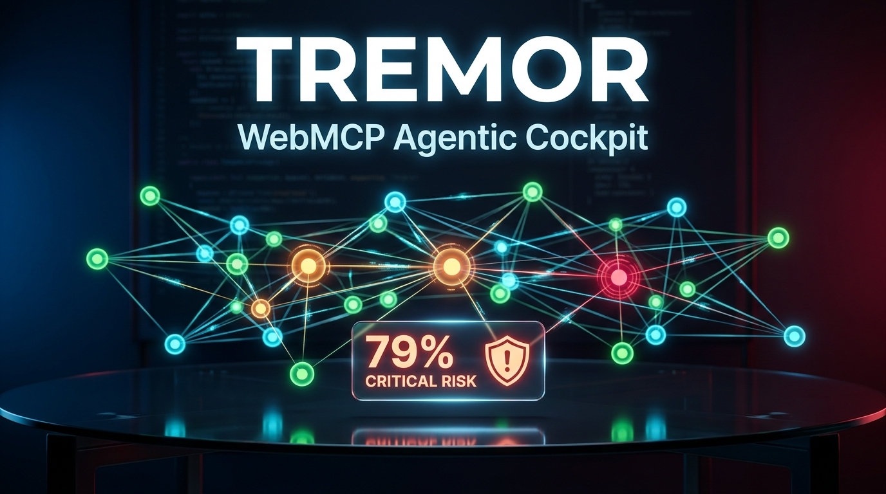

# TREMOR
### Agentic Blast Radius & Systemic Regression Prevention Cockpit

> **Tagline:** *See what your AI agent is about to break — before it does.*  
> Built for the **WebMCP Challenge 2026** (OpenAI, Google Chrome, Vercel, Cloudflare, Netlify, Shopify, Render).

[](https://tremor-cockpit.vercel.app)
[](https://github.com/mcp-b/global)
[](https://github.com/ABHIGH15/TREMOR)
[](./LICENSE)

> *Note: TREMOR is an independent project built for the WebMCP Challenge 2026. It is not affiliated with the `@tremor/react` UI component library or `tremor-runtime`.*

---



---

## The Problem: AI Agent Myopia

Autonomous coding agents (Claude Code, Cursor, Codex, ChatGPT) excel at editing functions in isolation, but they operate with narrow context:

1. **Localized Context:** When an agent refactors a single backend service (such as `auth-service/session.ts`), it only sees that file. It has no intrinsic awareness of the downstream microservices that consume that token schema.
2. **Cascading Failures:** A small cache TTL change can pass local unit tests, but under production traffic it triggers a cache stampede on Redis, degrading checkout queues across dependent services.
3. **Siloed CI Pipelines:** Standard test runners typically execute tests mapped only to the modified directory, allowing systemic regressions to ship undetected.

---

## The Solution: TREMOR Cockpit

Existing backend MCP tools hand agents blast-radius data as raw text in a terminal. TREMOR is browser-native — a human and their agent look at the same live impact graph in the same tab, and nothing risky ships without a human clicking Confirm.

When an AI agent connects via WebMCP (`document.modelContext`), the application exposes structured tools:
- The agent queries topology and runs pre-execution blast simulations via multi-root BFS traversal.
- The 2D force graph visually highlights the impacted blast zone in real time.
- If a proposed change exceeds safe risk thresholds, the agent flags it for human review.

---

## Dual-Engine Architecture

TREMOR features two distinct operational modes:

1. **🏢 Enterprise Demo Scenario (Default):**
   - Curated 18-microservice enterprise topology featuring the complex `auth-service` $\to$ `redis-session-cluster` P1 outage scenario, flaky test suites, dynamic tool unregistration, and a human confirmation gate with counterfactual incident replay.

2. **🌐 Live GitHub Repository Ingestion:**
   - Ingests any public GitHub repository (default: `ABHIGH15/TREMOR`).
   - The browser fetches the repository file tree, retrieves source files via CDN, and regex-extracts genuine `import ... from` and `require(...)` statements to construct real file-to-file dependency edges.
   - Dynamically calculates graph centrality risk scores and streams live commit provenance—entirely client-side without any backend server.

---

## The 6-Tool WebMCP Architecture Suite

TREMOR registers six tools directly onto `document.modelContext` using the `@mcp-b/global` polyfill:

| # | Tool Name | Primary Purpose | Live UI Effect |
|---|---|---|---|
| 1 | `get_system_snapshot` | Returns topology (18 nodes, 28 edges), risk bottlenecks, tests, and incidents | Orientation payload for agents |
| 2 | `get_blast_radius` | Transitive BFS reach across downstream callers and affected test suites | Highlights downstream blast zone in red |
| 3 | `check_regression_history` | Pattern matcher for historical outages, failure modes, and commit authors | Surfaces related incident cards |
| 4 | `get_change_provenance` | Audit trail tagging commits by AI agent vs human author ratio | Opens change provenance breakdown |
| 5 | `simulate_change_impact` | Simulates proposed refactors and computes composite risk index (0–1.0) | Pulses modified nodes and renders impact banner |
| 6 | `flag_for_review` | Registers a pending review flag that requires human sign-off | Queues pending item in review gate |

### WebMCP Registration Example

Tools are registered directly onto `document.modelContext` following the WebMCP specification:

```typescript
// Tool registration in src/webmcp/tools.ts
await document.modelContext.registerTool({
  name: 'get_blast_radius',
  description: 'Returns everything downstream of a module: dependent modules, affected tests, and past incidents tied to it. Also triggers the on-screen graph to visually highlight the impact zone.',
  inputSchema: {
    type: 'object',
    properties: {
      module: {
        type: 'string',
        description: 'The ID of the module or service to inspect (e.g. "auth-service", "checkout-service", "db-client-pool")',
      },
    },
    required: ['module'],
  },
  execute: async ({ module }: { module: string }) => {
    const targetNode = nodeMap.get(module);
    if (!targetNode) {
      return { isError: true, content: [{ type: 'text', text: `Module '${module}' not found.` }] };
    }

    // 1. Transitive BFS traversal
    const downstreamIds = computeDownstreamTransitive(module, dataset);
    const allImpactedIds = [module, ...downstreamIds];

    // 2. Collate affected tests & historical incidents
    const affectedTests = dataset.tests.filter(t => allImpactedIds.includes(t.module));
    const relatedIncidents = dataset.incidents.filter(i => allImpactedIds.includes(i.module));

    // 3. Highlight impact zone on live canvas
    callbacks.onHighlightImpactZone?.(allImpactedIds, targetNode);

    // 4. Return standard MCP content payload
    return {
      content: [{
        type: 'text',
        text: JSON.stringify({
          target_module: module,
          downstream_dependents: downstreamIds,
          total_impacted_modules: allImpactedIds.length,
          affected_tests: affectedTests,
          historical_incidents: relatedIncidents,
        }, null, 2),
      }],
    };
  },
});
```

---

## The Trust Layer: Human Confirmation Gate

To prevent automated self-approval loops, TREMOR separates flagging from resolution:

When an agent calls `flag_for_review`, the change enters a pending review state with `can_tool_self_approve: false`. There is deliberately no WebMCP tool that allows an agent to approve or dismiss its own flags. The change remains locked until an authorized engineer reviews the blast radius in the cockpit and clicks **Confirm / Approve**.

---

## Verified in Native ChatGPT In-App Browser

TREMOR has been verified live inside the official ChatGPT in-app browser:

> *"Available WebMCP tools: `get_blast_radius`, `check_regression_history`, `get_change_provenance`, `simulate_change_impact`, `flag_for_review`, `get_system_snapshot`... Result: predicted blast-risk index 0.79 (Critical Risk; human review required). Identified 9 total nodes in scope with 12 impacted tests..."*

The complete [verbatim ChatGPT test transcript](./verification/chatgpt-transcript.md) is available in the verification directory.

---

## Architecture & Tech Stack

- **Frontend:** React 18, TypeScript, Vite
- **Styling:** Tailwind CSS (obsidian dark theme `#070a12`, glassmorphism banners)
- **Graph Engine:** `react-force-graph-2d` (HTML5 Canvas 2D physics, 60fps particle streams)
- **WebMCP Protocol:** Official `@mcp-b/global@5.1.0` polyfill
- **Hosting:** Vercel Global Edge CDN ([https://tremor-cockpit.vercel.app](https://tremor-cockpit.vercel.app))

---

## Keyboard Shortcuts & Accessibility

TREMOR meets WCAG 2.1 AA accessibility standards with high-contrast `:focus-visible` rings and keyboard navigation:

| Shortcut | Action |
|---|---|
| <kbd>H</kbd> | Focus Hero Node (`auth-service`) |
| <kbd>S</kbd> | Run centerpiece simulation |
| <kbd>R</kbd> | Reset graph camera and highlights |
| <kbd>Esc</kbd> | Close open panels or clear simulation |
| <kbd>?</kbd> or <kbd>/</kbd> | Open About and architecture modal |
| <kbd>Tab</kbd> | Cycle focus across interactive controls |

---

## Local Development

```bash
# 1. Clone repository
git clone https://github.com/ABHIGH15/TREMOR.git
cd TREMOR

# 2. Install dependencies
npm install

# 3. Start development server
npm run dev

# 4. Build production bundle
npm run build

# 5. Run WebMCP verification suite
node scripts/regression-suite.mjs
```

---

## Known Limitations & What's Next

TREMOR ships today with a dual-engine architecture: a curated enterprise demo scenario with historical incidents and flaky test suites, alongside live GitHub repository ingestion that extracts real file-to-file dependency edges via client-side regex parsing.

To maintain a zero-backend, browser-native runtime within hackathon constraints, several technical trade-offs were made:

1. **Regex-Based Import Extraction vs. Full AST Parsing:** Current live ingestion uses regex-based pattern matching to resolve ES module `import ... from` and CommonJS `require(...)` paths. While fast and zero-install, it does not construct a full compiler Abstract Syntax Tree (AST) or resolve complex dynamic runtime imports. The roadmap includes compiling Tree-sitter to WebAssembly for static-analysis-grade parsing directly in the browser thread.
2. **File-Level vs. Symbol-Level Granularity:** Edges currently represent module-level dependencies rather than granular function-to-function call graphs or TypeScript type exports.
3. **Language Scope:** Live import extraction is currently optimized for JavaScript and TypeScript projects with relative module paths. Full path resolution for Python virtual environments, Go workspace modules, and Rust crates is planned for future releases.
4. **Static Topology vs. Runtime Traces:** Dependency maps reflect static source code imports; integrating OpenTelemetry distributed trace spans will enable weighting edges by real-time production RPC traffic volume.

---

## License

[MIT License](./LICENSE) — Free and open source.
